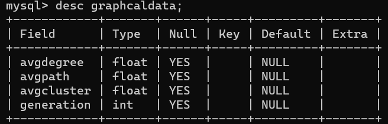
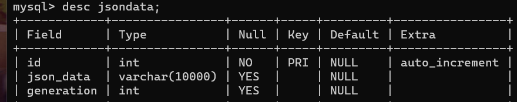
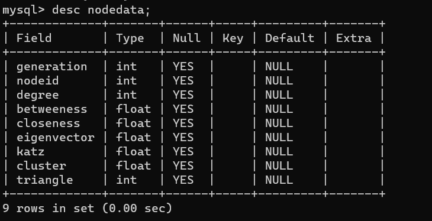

# 网络演化可视化系统

- ### 使用说明

>项目依赖`python-flask`，`jquery` ，`mysql` 前后端结合实现网络演化可视化系统。   ---使用前请安装必要的包文件，配置好对应的环境。

- ### 使用流程

  ##### 1.先加载数据库mysql

  前提完成数据库结构的搭建
	
<<<<<<< HEAD
  实例如下：
	
  
=======
	实例如下：
	
	
>>>>>>> 1ad69c2 (软件课设最终版)
	
  

  

  
  ##### 2.运行对应jquery.py主程序
  
  在对应`localhost:5000` 本地服务器端口下可以实现测试！

- ### 欢迎使用

  喜欢就请帮忙一个star！！！

