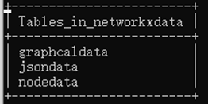
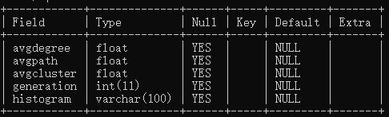
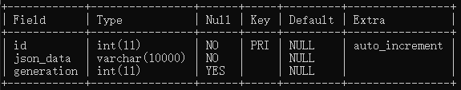

# 网络演化可视化系统

- ### 使用说明

>项目依赖`python-flask`，`jquery` ，`mysql` 前后端结合实现网络演化可视化系统。   ---使用前请安装必要的包文件，配置好对应的环境。

- ### 使用流程

  ##### 1.先加载数据库mysql

   
	
	 
	
   

	 
	
	
	  ##### 2.运行对应jquery.py主程序
	
	  	在对应`localhost:5000` 本地服务器端口下可以实现测试！
	
- ### 欢迎使用

  喜欢就请帮忙一个star！！！

