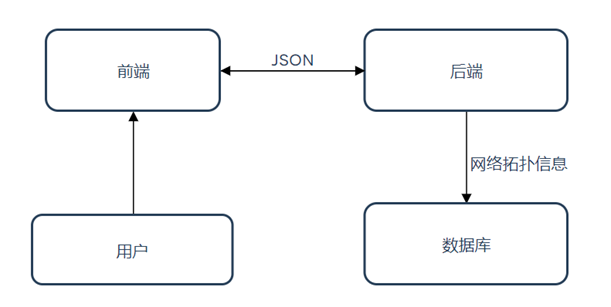
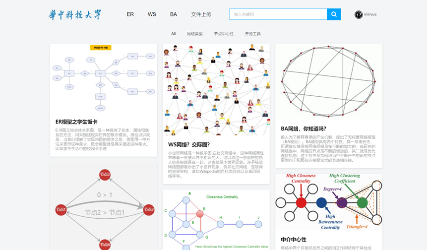
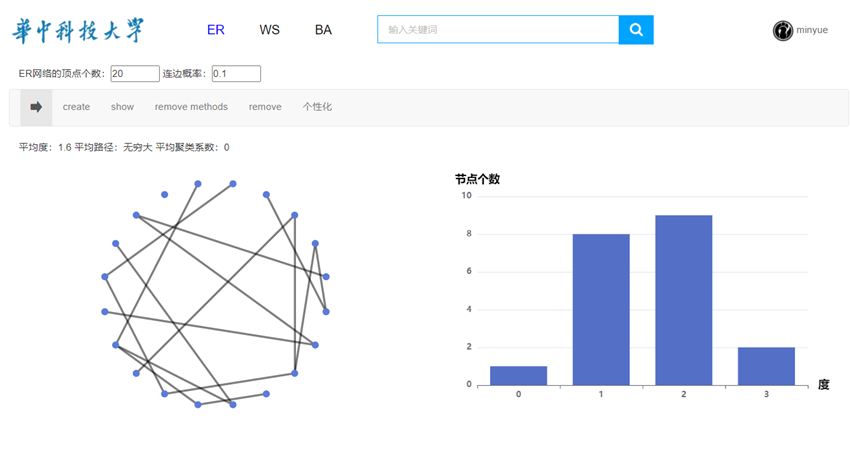

# 网络演化可视化系统

### 使用说明

>项目依赖`python-flask`，`jquery` ，`mysql` 前后端结合实现网络演化可视化系统。   ---使用前请安装必要的包文件，配置好对应的环境。

### 使用流程

##### 1.先加载数据库mysql

 

 

 

 

##### 2.运行对应jquery.py主程序

  	在对应`localhost:5000` 本地服务器端口下可以实现测试！

### 界面与效果展示

- 首页

- 功能页

### 欢迎使用-----best wishes！